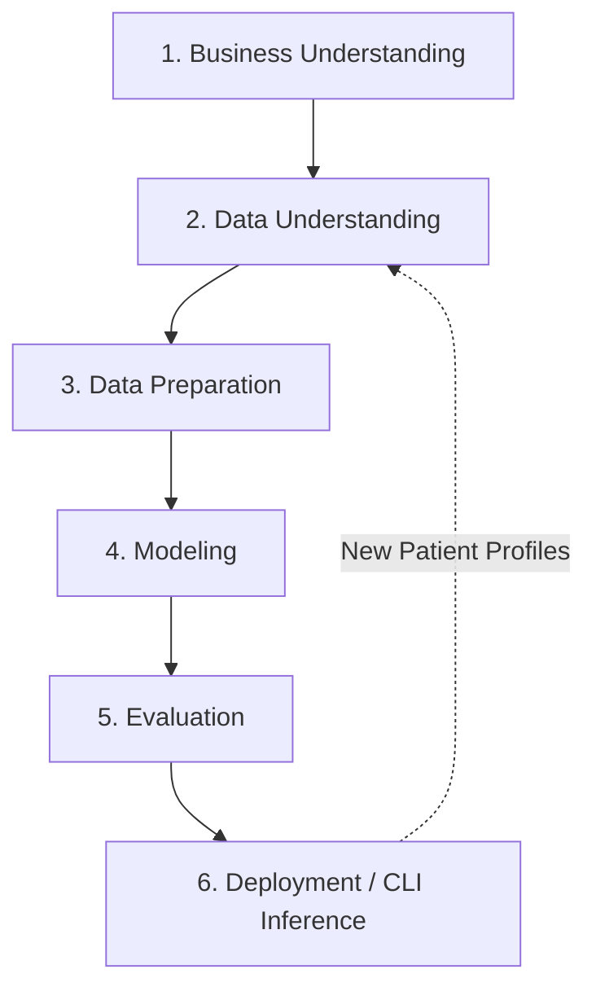

# Cardiac Risk Stratification - MLP End-to-End Pipeline

[](https://www.python.org/)
[](https://tensorflow.org)
[](https://scikit-learn.org)

An end-to-end Machine Learning pipeline utilizing a **Multi-Layer Perceptron (MLP)** neural network built with TensorFlow and Keras to predict cardiac risk (presence of heart disease) from clinical diagnostics. The project structure and process model are built around the **CRISP-DM (Cross-Industry Standard Process for Data Mining)** methodology.

---

## 📋 Table of Contents
1. [Project Overview](#-project-overview)
2. [CRISP-DM Process Implementation](#-crisp-dm-process-implementation)
3. [Dataset & Clinical Features](#-dataset--clinical-features)
4. [Neural Network Architecture](#-neural-network-architecture)
5. [Repository Structure](#-repository-structure)
6. [Installation & Setup](#-installation--setup)
7. [How to Run](#-how-to-run)
8. [Model Evaluation Results](#-model-evaluation-results)

---

## 🔍 Project Overview

Cardiac diseases remain one of the leading causes of mortality globally. Early detection and risk stratification can save lives by triggering timely clinical interventions. 

This repository implements a complete deep learning workflow that:
- Preprocesses and cleans patient diagnostic features.
- Dynamically builds, regularizes, and trains an MLP classification model.
- Evaluates the model with professional-grade classification metrics (Confusion Matrix, ROC-AUC).
- Offers an interactive CLI inference tool for healthcare practitioners or researchers to stratify risk for a single patient profile in real time.

---

## 🌀 CRISP-DM Process Implementation

This codebase strictly structures the model development process across standard CRISP-DM phases:



### 1. Business & Data Understanding
* **Goal**: Detect if a patient has cardiac risk (target classification `1` vs `0` normal) using non-invasive clinical attributes.
* **Data Inspection**: Automated validation checks shape, missing values, column distribution, and class balance of the Cleveland-like heart disease dataset (`heart_disease.csv`).

### 2. Data Preparation (`src/dataset.py`)
* **Consolidation**: Copies/verifies datasets and prepares directories.
* **Cleaning**: Assesses data completeness.
* **Feature Scaling**: Applies Scikit-Learn's `StandardScaler` to normalize continuous variables, preventing numerical bias. The trained scaler configuration is saved as `models/scaler.pkl` to scale real-time user inputs.
* **Data Partitioning**: Splits the data into **Training (70%)**, **Validation (15%)**, and **Testing (15%)** sets using stratified splits to maintain class distributions across sets.

### 3. Modeling (`src/model.py`, `src/train.py`)
* **Network Construction**: Builds a Sequential Keras MLP with fully-connected (`Dense`) layers, Batch Normalization, and Dropout layers for regularization.
* **Training Callbacks**:
  * `EarlyStopping`: Monitors validation loss and stops training if it stalls for `20` consecutive epochs to prevent overfitting.
  * `ModelCheckpoint`: Automatically saves the best model version to `models/cardiac_mlp_model.keras` based on validation loss.

### 4. Evaluation (`src/evaluate.py`)
* Loads the saved model and predicts outputs for the unseen test set.
* Generates standard visual reports:
  * **Training History (Loss & Accuracy Curves)**: saved to `reports/figures/training_history.png`.
  * **Confusion Matrix**: saved to `reports/figures/confusion_matrix.png`.
  * **ROC Curve & AUC Score**: saved to `reports/figures/roc_curve.png`.
* Saves raw text metrics to `reports/evaluation_report.txt`.

### 5. Deployment / Inference CLI (`src/predict.py`)
* A patient risk stratification interface that runs directly in the terminal, accepting user inputs for all 11 medical attributes and reporting the final class probability and tailored advice.

---

## 📊 Dataset & Clinical Features

The pipeline trains on `heart_disease.csv`, which contains **1025 patient instances** across **11 clinical attributes** and 1 binary classification target:

| Feature Name | Short Name | Type | Description / Acceptable Values |
|:---|:---|:---|:---|
| **Age** | `age` | Continuous | Age of the patient in years (1 to 120) |
| **Sex** | `sex` | Binary | `1` = Male, `0` = Female |
| **Chest Pain Type** | `chest_pain_type` | Categorical | `0`: Typical angina, `1`: Atypical angina, `2`: Non-anginal pain, `3`: Asymptomatic |
| **Resting BP** | `resting_bp` | Continuous | Resting blood pressure in mm Hg (50 to 250) |
| **Cholesterol** | `cholesterol` | Continuous | Serum cholesterol in mg/dL (80 to 600) |
| **Fasting Blood Sugar** | `fasting_blood_sugar` | Binary | Fasting blood sugar > 120 mg/dL (`1` = True, `0` = False) |
| **Resting ECG** | `resting_ecg` | Categorical | Resting electrocardiographic results (`0`, `1`, `2`) |
| **Max Heart Rate** | `max_heart_rate` | Continuous | Maximum heart rate achieved (50 to 220) |
| **Exercise Angina** | `exercise_angina` | Binary | Exercise-induced angina (`1` = Yes, `0` = No) |
| **Oldpeak** | `oldpeak` | Continuous | ST depression induced by exercise relative to rest (0.0 to 10.0) |
| **ST Slope** | `st_slope` | Categorical | Slope of the peak exercise ST segment (`0`, `1`, `2`) |
| **Target (Label)** | `target` | Binary | Class label (`0` = No disease, `1` = Heart disease present) |

---

## 🧠 Neural Network Architecture

The default Multilayer Perceptron structure utilizes two hidden dense layers:

```
[Input Layer: 11 Features]
           │
           ▼
[Dense Layer: 64 Units] ──► [Batch Normalization] ──► [Dropout (Rate: 0.2)] ──► [ReLU]
           │
           ▼
[Dense Layer: 32 Units] ──► [Batch Normalization] ──► [Dropout (Rate: 0.2)] ──► [ReLU]
           │
           ▼
[Output Layer: 1 Unit] ──► [Sigmoid Activation (Binary Risk Classification)]
```

* **Optimizer**: Adam (learning rate = `0.001`)
* **Loss Function**: Binary Crossentropy
* **Regularization**: Batch Normalization stabilizes internal covariate shift; Dropout (20%) reduces co-dependency between neurons.

---

## 📂 Repository Structure

```
.
├── Data/                       # Raw and processed datasets
│   └── heart_disease.csv       # Clinical dataset CSV
├── models/                     # Saved models and scalers
│   ├── cardiac_mlp_model.keras # Best trained Keras model weights
│   └── scaler.pkl              # Fitted StandardScaler configuration
├── reports/                    # Training and evaluation outputs
│   ├── evaluation_report.txt   # Text file containing test set classification metrics
│   └── figures/                # Performance diagnostic plots
│       ├── confusion_matrix.png
│       ├── roc_curve.png
│       └── training_history.png
├── src/                        # Source code modules
│   ├── dataset.py              # Data loading, splitting, and scaling
│   ├── evaluate.py             # Evaluation metrics and plotting utilities
│   ├── model.py                # MLP architecture specification
│   ├── predict.py              # CLI interactive single-patient inference
│   └── train.py                # Model training routine with early stopping
├── main.py                     # Project pipeline entrypoint
├── requirements.txt            # Package dependencies
└── .gitignore                  # Git patterns to ignore
```

---

## ⚙️ Installation & Setup

1. **Clone this repository** (or navigate to your local workspace):
   ```bash
   git clone <repository_url>
   cd Neural-Network-Project
   ```

2. **Set up a virtual environment** (recommended):
   ```bash
   python -m venv venv
   # On Windows:
   .\venv\Scripts\activate
   # On macOS/Linux:
   source venv/bin/activate
   ```

3. **Install dependencies**:
   ```bash
   pip install -r requirements.txt
   ```

---

## 🚀 How to Run

### Run the End-to-End Training and Evaluation Pipeline
Execute the pipeline to load the dataset, partition it, train the model, save weights, and write evaluation reports to disk:
```bash
python main.py
```

### Run the Interactive Patient Risk Inference CLI
Execute prediction mode to run the interactive CLI in your terminal. You can supply diagnostic numbers or press `Enter` to use clinical defaults:
```bash
python main.py --predict
```

*Example Interactive Session:*
```text
==================================================
     CARDIAC RISK STRATIFICATION - MLP INFERENCE CLI    
==================================================
Successfully loaded model weights and StandardScaler scaler config.

Enter patient diagnostic metrics (or type 'q' to quit):
 - Age (Age (years)) [default: 54]: 60
 - Sex (Sex (1 = Male, 0 = Female)) [default: 1]: 1
 - Chest Pain Type (Chest pain type [0: typical, 1: atypical, 2: non-anginal, 3: asymptomatic]) [default: 1]: 2
 - Resting BP (Resting blood pressure [mm Hg]) [default: 130]: 140
 - Cholesterol (Serum cholesterol [mg/dL]) [default: 240]: 268
 - Fasting Blood Sugar (Fasting blood sugar > 120 mg/dL (1 = True, 0 = False)) [default: 0]: 0
 - Resting ECG (Resting electrocardiographic results [0, 1, 2]) [default: 1]: 0
 - Max Heart Rate (Maximum heart rate achieved) [default: 150]: 160
 - Exercise Angina (Exercise induced angina (1 = Yes, 0 = No)) [default: 0]: 0
 - Oldpeak (ST depression induced by exercise relative to rest) [default: 1.0]: 3.6
 - ST Slope (Slope of peak exercise ST segment [0, 1, 2]) [default: 1]: 0

Input parameters summarized:
 - Age                      : 60.0
 - Sex                      : 1.0
 - Chest Pain Type          : 2.0
 - Resting BP               : 140.0
 - Cholesterol              : 268.0
 - Fasting Blood Sugar      : 0.0
 - Resting ECG              : 0.0
 - Max Heart Rate           : 160.0
 - Exercise Angina          : 0.0
 - Oldpeak                  : 3.6
 - ST Slope                 : 0.0

----------------------------------------
          PREDICTION RESULT          
----------------------------------------
Probability of Cardiac Risk: 1.13%
Risk Classification:        LOW RISK (NORMAL)

Advice: The patient exhibits a low risk profile. Maintenance of a healthy lifestyle is recommended.
----------------------------------------
```

---

## 📈 Model Evaluation Results

After running the complete training process, the MLP achieved the following metrics on the test split:

* **Accuracy**: **95.45%** (Correctly stratifying 147 out of 154 test patients)
* **Precision**: **97.37%** (When predicting cardiac risk, the prediction is correct 97.37% of the time)
* **Recall (Sensitivity)**: **93.67%** (Successfully identifying 93.67% of patients carrying cardiac risk)
* **Specificity**: **97.33%** (Correctly identifying 97.33% of patients with no cardiac disease)
* **F1-Score**: **95.48%**
* **AUC-ROC**: **0.9887** (Indicates exceptional model discrimination power)

### Confusion Matrix Counts
* **True Negatives (TN)**: 73
* **False Positives (FP)**: 2
* **False Negatives (FN)**: 5
* **True Positives (TP)**: 74

*(Visual details including loss, accuracy, confusion matrix, and ROC-AUC curves can be inspected in the `reports/figures/` directory).*
