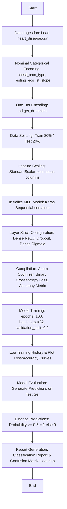

# BAXI 3133: Neural Network (Group Mini-Project Documentation)
## Topic: Cardiac Risk Stratification
### Course Details: Universiti Teknikal Malaysia Melaka (UTeM) - Semester 2, Sesi 2025/2026

This documentation is structured to support the report compilation requirements for your group mini-project, specifically matching the sections for **Detail on Deep Learning Functions** and **Data Flow Logic for Flowchart Construction**.

---

## 1. Detail on Deep Learning / Neural Network Functions

Copy the following text directly into the designated report section discussing the neural network architecture and functions:

| Keras/TensorFlow Function | Mathematical Formulation / Implementation | Description & Project Role |
| :--- | :--- | :--- |
| **`Sequential`** | $y = f_L(f_{L-1}(...f_1(x)))$ | A Keras container that groups a linear stack of layers. It allows layers to be stacked sequentially where each layer has exactly one input tensor and one output tensor, forming the feedforward flow. |
| **`Input` layer** | $x \in \mathbb{R}^d$ | Instantiates a Keras symbolic tensor that specifies the input shape matching the preprocessed features count ($d = 17$ after one-hot encoding). Allocates initial weight dimensions. |
| **`Dense` layer** | $a = g(W^T x + b)$ | A fully-connected layer where each neuron receives input from all neurons in the previous layer. It computes the weighted sum of inputs plus bias and applies an activation function $g$. |
| **`ReLU` activation** | $f(x) = \max(0, x)$ | Rectified Linear Unit activation function applied in all hidden layers. It introduces non-linearity and helps mitigate the vanishing gradient problem, allowing deep networks to converge faster. |
| **`Sigmoid` activation** | $f(x) = \frac{1}{1 + e^{-x}}$ | Applied at the output layer (containing 1 neuron). It squashes the raw real-valued scores into a probabilistic range of $[0, 1]$ representing the risk of heart disease. |
| **`Dropout` layer** | $p_{keep} = 1 - p_{drop}$ | A regularization technique. It randomly zeroes out a portion ($20\%$) of layer outputs during training epochs. This prevents co-adaptation of neurons and minimizes overfitting. |
| **`compile` method** | Configures modeling params | Binds the architecture with the optimization algorithm, the loss function, and the metrics to calculate performance during training. |
| **`Adam` optimizer** | Adaptive learning rates | An optimization algorithm that uses running averages of both the gradients (first moment) and the squared gradients (second moment) to dynamically adapt learning rates for every weight parameter. |
| **`binary_crossentropy`** | $L = -\frac{1}{N}\sum_{i=1}^N \left[ y_i \log(\hat{y}_i) + (1 - y_i)\log(1 - \hat{y}_i) \right]$ | The loss function used for binary classification. It penalizes the difference between predicted probabilities ($\hat{y}$) and true labels ($y \in \{0, 1\}$). |
| **`fit` method** | Stochastic Gradient Descent iterations | Runs the model training loops for a fixed number of epochs ($100$) in mini-batches ($32$), computing gradients, adjusting weights via backpropagation, and validating on a split ($20\%$). |
| **`predict` method** | Model Feedforward | Runs a forward pass of test set observations through the trained weights to output probability risk scores. |

---

## 2. Pipeline Logic Flow (For Flowchart Construction)

Use the following step-by-step logic layout to draw your project flowchart diagram. The diagram should proceed sequentially as follows:

### Detailed Text Description of Flowchart Steps:

1. **Start**: Initialize program environment.
2. **Data Ingestion**: Load the `heart_disease.csv` dataset into memory using pandas.
3. **Data Cleaning**: Verify the 12 specified columns: `age`, `sex`, `chest_pain_type`, `resting_bp`, `cholesterol`, `fasting_blood_sugar`, `resting_ecg`, `max_heart_rate`, `exercise_angina`, `oldpeak`, `st_slope`, and `target`.
4. **Categorical Handling**: Cast nominal variables `chest_pain_type` (1 to 4), `resting_ecg` (0 to 2), and `st_slope` (0 to 2) as string format to signify category boundaries.
5. **One-Hot Encoding**: Execute pandas `get_dummies` to expand nominal columns into binary flags (0 or 1), converting all boolean values to `float32` for Keras compatibility.
6. **Data Partitioning**: Partition the features ($X$) and targets ($y$) using `train_test_split` with `test_size=0.2` and `stratify=y` to preserve dataset target ratio.
7. **Feature Standardization**:
   - Fit `StandardScaler` on training continuous variables (`age`, `resting_bp`, `cholesterol`, `max_heart_rate`, `oldpeak`) to find training mean ($\mu$) and standard deviation ($\sigma$).
   - Standardize training continuous variables: $x_{scaled} = \frac{x - \mu}{\sigma}$.
   - Transform testing continuous variables using the exact training parameters ($\mu, \sigma$) to prevent information leakage.
8. **Define Architecture**: Initialize Keras `Sequential` container.
   - Attach an input layer matching the number of features.
   - Attach Hidden Dense Layer 1 (64 units, activation = `'relu'`).
   - Attach Dropout Layer 1 (rate = `0.2` or $20\%$).
   - Attach Hidden Dense Layer 2 (32 units, activation = `'relu'`).
   - Attach Dropout Layer 2 (rate = `0.2` or $20\%$).
   - Attach Output Dense Layer (1 unit, activation = `'sigmoid'`).
9. **Model Compilation**: Compile with `'adam'` optimizer, `'binary_crossentropy'` loss, and track `['accuracy']` as the training metric.
10. **Model Training**: Execute `model.fit()` with `epochs=100`, `batch_size=32`, and a validation split of `0.2`.
11. **Learning Curves Plotting**: Extract history dictionary and plot training vs validation Loss, and training vs validation Accuracy across epochs.
12. **Inference**: Generate probabilistic risk scores ($\hat{y}_{prob}$) for the test set using `model.predict()`.
13. **Prediction Binarization**: Classify target outputs:
    $$\text{Class} = \begin{cases} 1 & \text{if } \hat{y}_{prob} \ge 0.5 \\ 0 & \text{if } \hat{y}_{prob} < 0.5 \end{cases}$$
14. **Metrics Computation**: Generate and print the confusion matrix (True Positives, False Positives, False Negatives, True Negatives) and the classification report containing Precision, Recall, F1-Score, and overall Accuracy. Visualize the confusion matrix as a Seaborn heatmap.
15. **End**: Save evaluation graphs and output final risk stratification weights.
